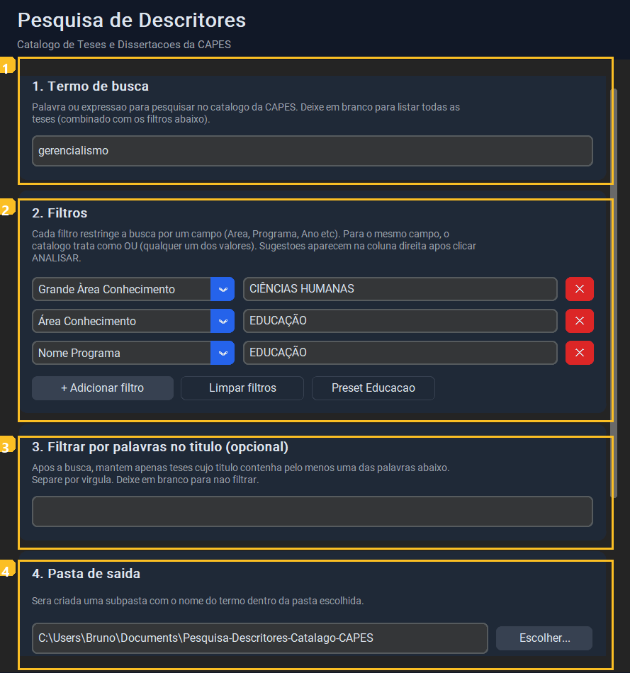
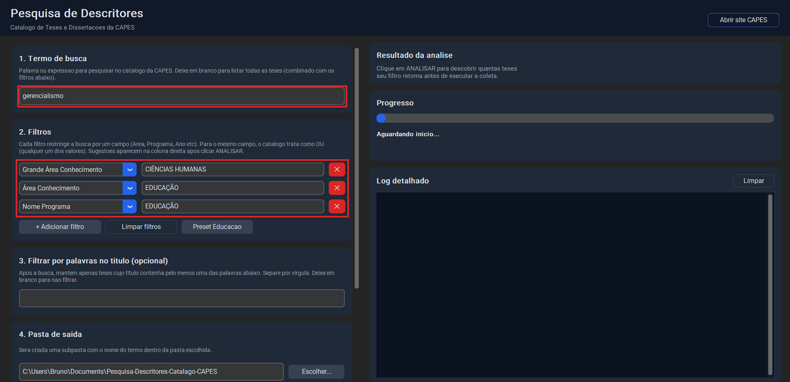
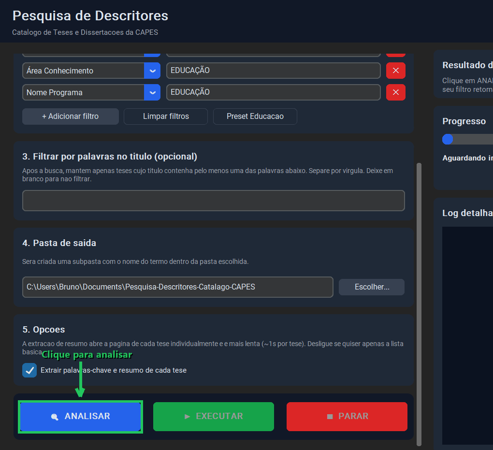
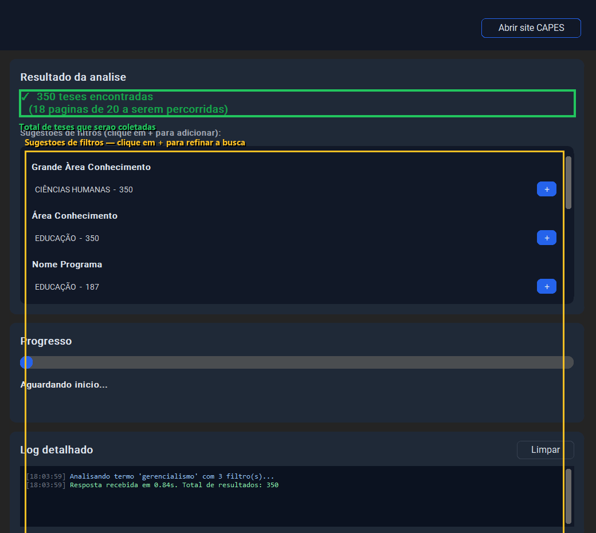
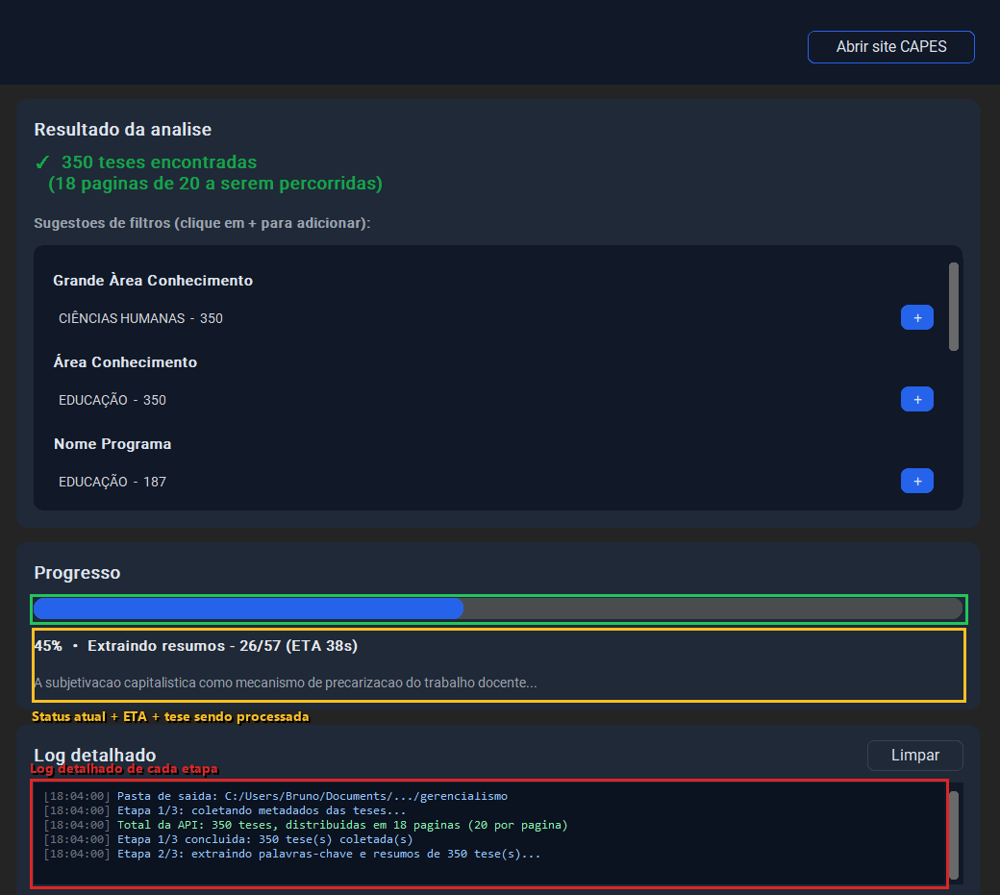
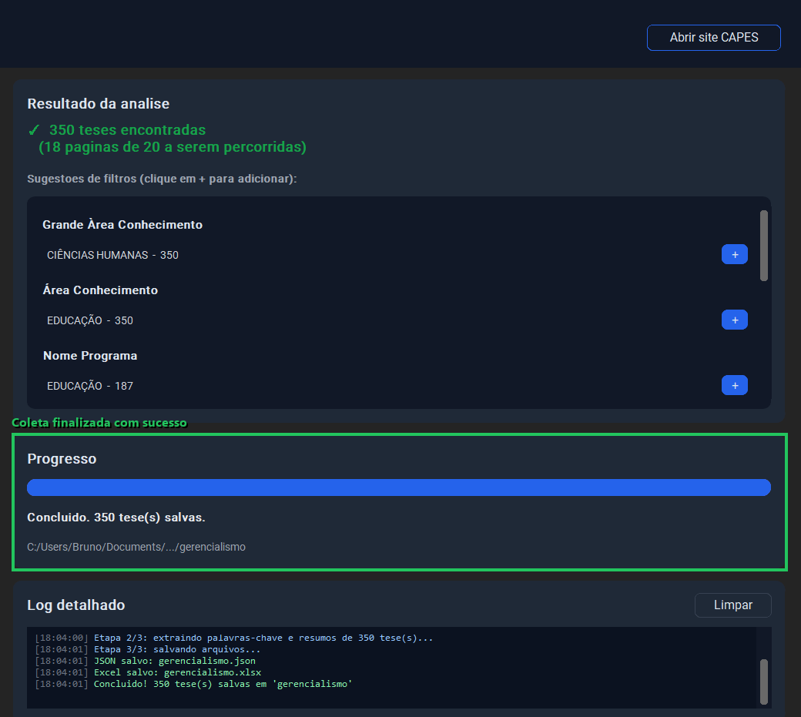

# Pesquisa de Descritores — Catálogo de Teses e Dissertações da CAPES

Programa para automatizar a busca e coleta de teses e dissertações no [Catálogo de Teses e Dissertações da CAPES](https://catalogodeteses.capes.gov.br), extraindo título, autor, grau acadêmico, data de defesa, palavras-chave e resumo de cada trabalho encontrado.

Os resultados são salvos automaticamente em planilhas Excel e arquivos JSON, organizados por descritor de busca.

O projeto oferece duas formas de uso:

- **Interface gráfica (recomendado)** — programa visual com filtros dinâmicos, análise prévia, barra de progresso e log detalhado
- **Linha de comando** — script Python tradicional para execução por terminal (documentado no fim deste README)

---

## Sumário

- [Pré-requisitos](#pré-requisitos)
- [Instalação](#instalação)
- [Como usar — passo a passo com a interface gráfica](#como-usar--passo-a-passo-com-a-interface-gráfica)
  - [Passo 1: visão geral da interface](#passo-1-visão-geral-da-interface)
  - [Passo 2: configurar termo e filtros](#passo-2-configurar-termo-e-filtros)
  - [Passo 3: clicar em ANALISAR](#passo-3-clicar-em-analisar)
  - [Passo 4: revisar o resultado e refinar (opcional)](#passo-4-revisar-o-resultado-e-refinar-opcional)
  - [Passo 5: clicar em EXECUTAR](#passo-5-clicar-em-executar)
  - [Passo 6: aguardar e abrir os arquivos gerados](#passo-6-aguardar-e-abrir-os-arquivos-gerados)
- [Gerando um executável único (.exe)](#gerando-um-executável-único-exe)
- [Estrutura do projeto](#estrutura-do-projeto)
- [Versão por linha de comando (CLI)](#versão-por-linha-de-comando-cli)
- [Observações](#observações)
- [Licença](#licença)

---

## Pré-requisitos

- **Python 3.8 ou superior** instalado na máquina
  Download: https://www.python.org/downloads/

> Se você só quer usar o programa pronto (sem instalar Python), peça/baixe o arquivo `PesquisaCAPES.exe` — ele roda sem dependências em qualquer Windows 10/11.

---

## Instalação

### 1. Clone o repositório

```bash
git clone https://github.com/bruno-itacaramby-dev/Pesquisa-Descritores-Catalago-CAPES.git
cd Pesquisa-Descritores-Catalago-CAPES
```

Ou baixe o ZIP pelo botão verde **"Code > Download ZIP"** no GitHub e extraia a pasta.

### 2. (Recomendado) Crie um ambiente virtual

Um ambiente virtual isola as dependências deste projeto e evita conflitos com outros programas Python na sua máquina.

**Windows:**
```bash
python -m venv venv
venv\Scripts\activate
```

**Mac/Linux:**
```bash
python3 -m venv venv
source venv/bin/activate
```

Você saberá que funcionou quando aparecer `(venv)` no início da linha do terminal.

### 3. Instale as dependências

```bash
pip install -r requirements.txt
```

Isso instala:

- `requests` — consultas HTTP ao site da CAPES
- `beautifulsoup4` — extrai palavras-chave e resumos das páginas das teses
- `openpyxl` — gera as planilhas Excel
- `customtkinter` — biblioteca visual da interface gráfica
- `pyinstaller` — necessário apenas se você for gerar o `.exe` único

---

## Como usar — passo a passo com a interface gráfica

Para abrir o programa, com o ambiente virtual ativo:

```bash
python gui_app.py
```

O programa abre maximizado em uma janela única.

---

### Passo 1: visão geral da interface

Quando você abre o programa, a tela está dividida em duas colunas:

- **Esquerda** — onde você configura a busca (5 seções numeradas + 3 botões de ação)
- **Direita** — onde aparecem os resultados, o progresso e o log

A imagem abaixo mostra a **coluna esquerda** com 4 das 5 seções visíveis. A 5ª (**Opções**) e os botões ANALISAR / EXECUTAR / PARAR aparecem ao rolar a coluna para baixo (veja o passo 3).



As cinco seções de configuração na coluna esquerda são:

| # | Seção | O que faz |
|---|---|---|
| 1 | **Termo de busca** | Palavra ou expressão a pesquisar (ex: `gerencialismo`). Se deixar em branco, lista todas as teses que casam com os filtros. |
| 2 | **Filtros** | Restringe a busca por campos específicos do catálogo (Grande Área, Área, Programa, Ano, Instituição, Orientador etc). |
| 3 | **Filtrar por palavras no título** | *Opcional.* Após a busca, mantém apenas teses cujo título contenha pelo menos uma das palavras informadas. |
| 4 | **Pasta de saída** | Onde os arquivos finais serão salvos. Será criada uma subpasta com o nome do termo. |
| 5 | **Opções** | Liga/desliga a extração de palavras-chave e resumo de cada tese (essa parte é a mais lenta). |

---

### Passo 2: configurar termo e filtros

Digite o termo no campo **1. Termo de busca** e ajuste os filtros em **2. Filtros**.

Cada filtro é um par **campo + valor**. Por exemplo:

- `Grande Àrea Conhecimento = CIÊNCIAS HUMANAS`
- `Área Conhecimento = EDUCAÇÃO`
- `Nome Programa = EDUCAÇÃO`

O programa vem com esses três filtros pré-preenchidos (mesmo padrão da versão CLI). Para limpar, use o botão **"Limpar filtros"**. Para voltar ao preset, use **"Preset Educação"**. Para adicionar mais um filtro, use **"+ Adicionar filtro"**.



> **Sobre os campos de filtro disponíveis:** o catálogo da CAPES aceita filtros nos campos `Grau Acadêmico`, `Ano`, `Autor`, `Orientador`, `Banca`, `Grande Àrea Conhecimento`, `Área Conhecimento`, `Área Avaliação`, `Área Concentração`, `Nome Programa`, `Instituição` e `Biblioteca`. Todos aparecem no dropdown de cada filtro.

---

### Passo 3: clicar em ANALISAR

Role a coluna esquerda até o final e você verá os três botões de ação. **Sempre comece por ANALISAR** — esse botão faz uma única requisição rápida para descobrir quantas teses sua busca vai retornar, **antes de iniciar a coleta completa**.



| Botão | Cor | O que faz |
|---|---|---|
| 🔍 **ANALISAR** | Azul | Faz uma consulta rápida e mostra o total de resultados + sugestões de filtros |
| ▶ **EXECUTAR** | Verde | Inicia a coleta completa (só fica ativo depois de uma análise bem-sucedida) |
| ■ **PARAR** | Vermelho | Cancela uma análise/coleta em andamento |

---

### Passo 4: revisar o resultado e refinar (opcional)

Após clicar em **ANALISAR**, a coluna direita exibe:

- ✓ **Total de teses encontradas** (em verde) — confirma que sua busca tem resultados
- **Sugestões de filtros** — os campos mais comuns nos resultados, com botão `+` ao lado de cada valor



Se o total for muito alto e você quer refinar, **clique no `+` ao lado de qualquer valor sugerido** para adicioná-lo como filtro automaticamente. Depois, clique em **ANALISAR** novamente para ver o novo total.

> Se o total ultrapassar 1.000 teses, o programa pede confirmação antes de executar (a coleta completa pode levar muitos minutos).

---

### Passo 5: clicar em EXECUTAR

Confirmado que o número de resultados está bom, clique em **EXECUTAR**. O programa começa a coleta em três etapas, mostrando progresso em tempo real:

- **Etapa 1/3** — percorre as páginas do catálogo (20 teses por página) coletando os metadados
- **Etapa 2/3** — abre cada tese individualmente e extrai palavras-chave + resumo *(opcional, ~1 segundo por tese)*
- **Etapa 3/3** — salva os resultados em JSON e Excel



Durante a execução você acompanha:

- **Barra de progresso** com porcentagem completa
- **Status atual** com a etapa, número da tese sendo processada e ETA (tempo estimado)
- **Título da tese** sendo processada no momento
- **Log detalhado** com cada passo (azul = info, verde = sucesso, amarelo = aviso, vermelho = erro)

Você pode clicar em **PARAR** a qualquer momento para cancelar.

---

### Passo 6: aguardar e abrir os arquivos gerados

Ao final, o painel de progresso fica verde com a mensagem **"Concluído. N tese(s) salvas."** e o caminho da pasta gerada.



Aparece também um diálogo perguntando se você quer abrir a pasta. Os arquivos gerados são:

| Arquivo | Conteúdo |
|---|---|
| `<termo>.json` | Lista completa em JSON |
| `<termo>.xlsx` | Planilha Excel com cabeçalho estilizado e links clicáveis |

Cada planilha tem as colunas: **título · autor · grau acadêmico · instituição · programa · município · biblioteca · data de defesa · palavras-chave · resumo · link**.

---

## Gerando um executável único (.exe)

Para distribuir o programa sem exigir Python instalado, você pode gerar um `.exe` único com PyInstaller:

```bash
pip install -r requirements.txt
pyinstaller --noconfirm --clean --onefile --windowed --name "PesquisaCAPES" --collect-all customtkinter --hidden-import bs4 --hidden-import openpyxl gui_app.py
```

O executável será criado em `dist/PesquisaCAPES.exe` (~33 MB). Esse arquivo único pode ser distribuído sem qualquer dependência externa — basta copiar e clicar duas vezes em qualquer Windows 10/11.

---

## Estrutura do projeto

```
.
├── app.py                       # Versão CLI (linha de comando)
├── gui_app.py                   # Interface gráfica
├── requirements.txt             # Dependências Python
├── docs/
│   ├── gerar_screenshots.py     # Script que regenera os prints deste README
│   ├── capturar_janela.py       # Captura uma janela aberta do app
│   └── screenshots/             # Imagens usadas no README
└── README.md
```

---

## Versão por linha de comando (CLI)

> Para usuários que preferem terminal e querem rodar a coleta sem interface gráfica.

A versão CLI é o script original (`app.py`) que roda toda a coleta a partir de uma lista de descritores definida no próprio código. Diferenças em relação à GUI:

- **Sem botão de análise prévia** — começa a coleta imediatamente para todos os termos da lista
- **Sem filtros editáveis na hora** — os filtros são fixos no código (`coletar_links()`)
- **Múltiplos termos numa rodada** — ideal para rodar uma lista grande de descritores em sequência
- **Usa Playwright** — abre Chromium para extrair palavras-chave (a GUI usa BeautifulSoup direto, mais leve)
- **Log no terminal** — sem barras visuais, usa `tqdm` no terminal

### 1. Dependências adicionais para a CLI

Além do `requirements.txt`, a versão CLI usa `tqdm` e `playwright`:

```bash
pip install tqdm playwright
playwright install chromium
```

### 2. Configurar os descritores de busca

Abra o arquivo `app.py` e localize a variável `termos`, próxima ao início:

```python
termos = [
    "gerencialismo"
]
```

Substitua ou adicione os descritores que deseja pesquisar. Exemplo:

```python
termos = [
    "avaliação e responsabilização docente",
    "controle do trabalho docente",
    "gerencialismo",
    "gerencialismo educacional",
    "nova gestão pública",
    "performatividade",
    "performatividade docente",
    "plataformas de gestão escolar",
    "plataformas digitais na educação"
]
```

Cada descritor gera uma pasta separada com seus respectivos arquivos.

### 3. (Opcional) Filtrar por palavras no título

Se quiser que apenas trabalhos com determinadas palavras no título sejam incluídos, edite a variável `keywords`:

```python
keywords = ["escola", "docente"]
```

Lista vazia (`keywords = []`) coleta todos os resultados.

### 4. (Opcional) Alterar os filtros aplicados

Por padrão a CLI filtra por:

- **Grande Área do Conhecimento:** Ciências Humanas
- **Área do Conhecimento:** Educação
- **Nome do Programa:** Educação

Para alterar, edite a lista `filtros` dentro da função `coletar_links` no arquivo `app.py`.

### 5. Executar

```bash
python app.py
```

O terminal exibirá o progresso da coleta em tempo real. Ao final, para cada descritor será criada uma pasta contendo:

| Arquivo | Conteúdo |
|---|---|
| `<descritor>.xlsx` | Planilha sem a coluna de resumo |
| `<descritor>_com_resumo.xlsx` | Planilha completa com resumo |
| `<descritor>.json` | Dados sem resumo em formato JSON |
| `<descritor>_com_resumo.json` | Dados completos em formato JSON |

---

## Observações

- O programa respeita um intervalo de aproximadamente 0,3 segundos entre cada página consultada para não sobrecarregar o servidor da CAPES.
- Todos os dados coletados são públicos e estão disponíveis abertamente no site da CAPES, sem qualquer restrição de acesso.
- Em caso de falha ao acessar a página de uma tese específica, o programa registra o trabalho com campos de palavras-chave e resumo em branco e continua normalmente.

---

## Licença

Este projeto é de uso livre para fins acadêmicos e de pesquisa.
